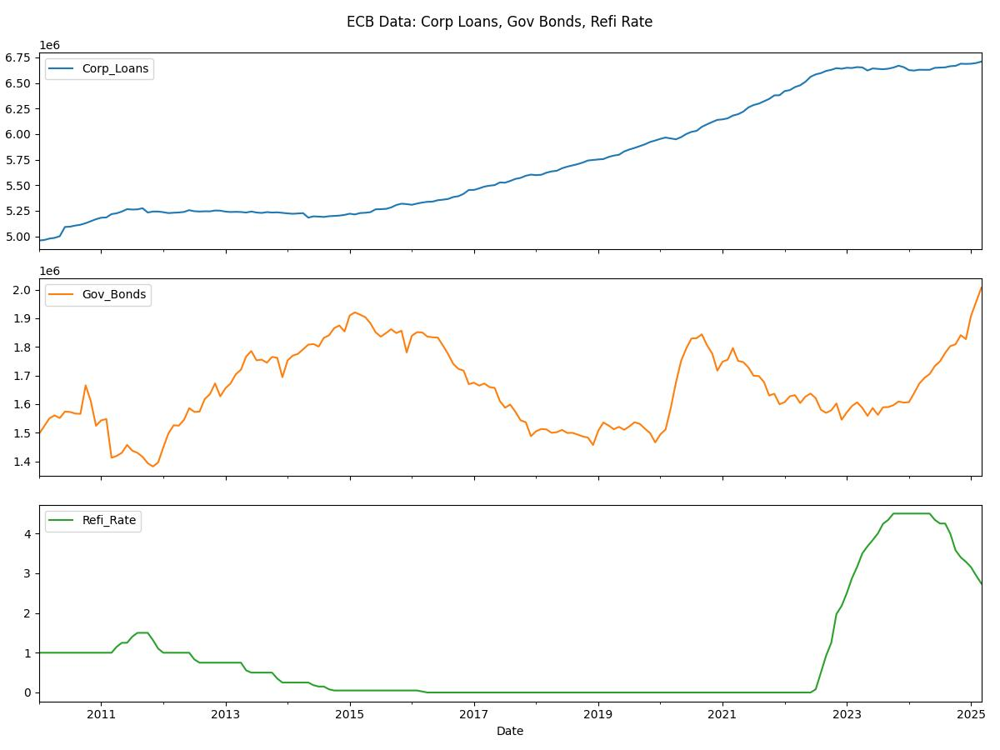
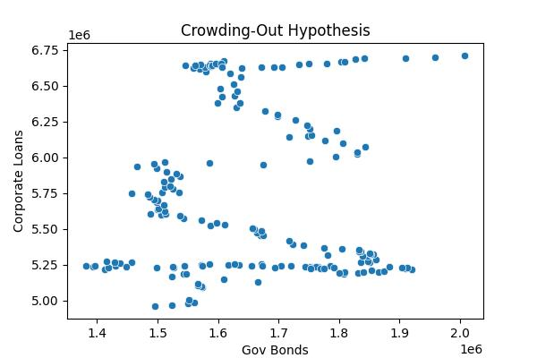
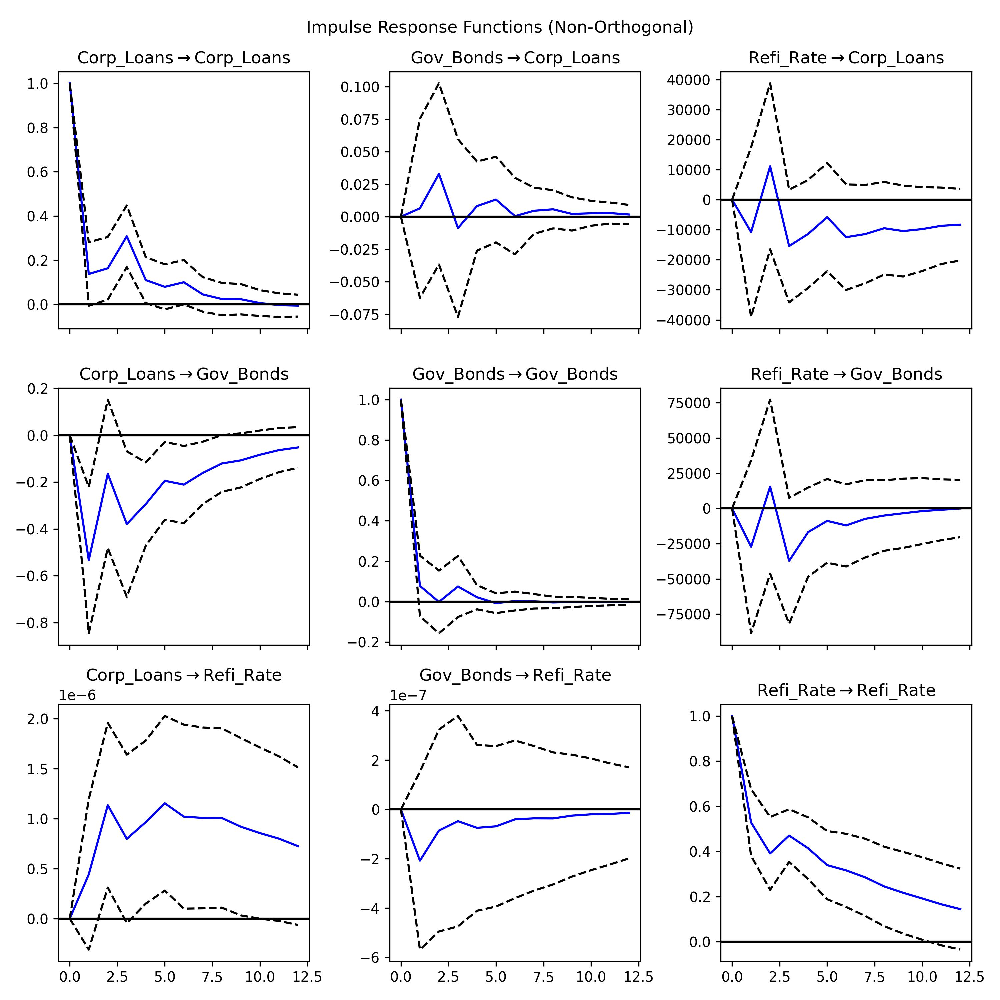

# ECB Monetary Policy and Bank Asset Allocation

**Research question**  
Does ECB monetary policy drive banks to prefer **corporate loans** over **government bonds**?

This repository contains a Python-based econometric analysis of the interaction between ECB policy rates, bank lending to the private sector, and sovereign bond holdings. Using official ECB datasets and time-series models, the project explores whether monetary policy decisions influence how banks allocate their balance sheets between government debt and corporate credit.

---

## 📊 Data

The following ECB series were retrieved via the SDMX API:

- **Loans to Non-Financial Corporations**  
  Measures the stock of credit extended to euro area firms by MFIs (excluding the Eurosystem).  
  *(Millions of EUR)*  
  Series key: `BSI.M.U2.N.A.A20.A.1.U2.2250.Z01.E`

- **Government Bond Holdings**  
  Total holdings of debt securities issued by euro area general governments, reported by MFIs (excluding the Eurosystem).  
  *(Millions of EUR)*  
  Series key: `BSI.M.U2.N.A.A30.A.1.U2.2100.Z01.E`

- **ECB Main Refinancing Rate**  
  Official policy rate applied to main refinancing operations (fixed rate tenders).  
  *(% per annum)*  
  Series key: `FM.D.U2.EUR.4F.KR.MRR_FR.LEV`

All series were harmonized to a **monthly frequency**, aligned by period, and cleaned for missing observations.

---

## 📈 Methodology

The analysis combines descriptive exploration with econometric modelling:

1. **Data processing**  
   - ECB SDMX API extraction  
   - Resampling to month-end frequency  
   - Missing-value handling and type conversion  

2. **Preliminary analysis**  
   - Time-series visualization  
   - Correlation matrix and scatterplots  

3. **Econometric tests**  
   - Augmented Dickey-Fuller (ADF) stationarity tests  
   - Ordinary Least Squares (OLS) regression  
   - Granger causality tests (lags up to 6)  
   - Vector Autoregression (VAR) with optimal lag selection  
   - Impulse Response Functions (IRFs) over 12 periods  

---

## 📑 Results

- **OLS regression**:  
  - Weak positive but statistically non-significant relationship between corporate loans and bond holdings.  
  - The refinancing rate does not show significant direct effects on lending.

- **Granger causality**:  
  - Government bond holdings do **not** predict corporate lending (p > 0.7).  
  - The refinancing rate **Granger-causes lending** (p < 0.01), indicating that monetary policy signals anticipate credit developments.

- **VAR(3) model**:  
  - Lending dynamics are primarily explained by their own lagged values.  
  - Lending negatively affects future government bond holdings (p < 0.01), consistent with a **reallocation away from sovereign debt as credit expands**.

- **Impulse Response Functions**:  
  - Policy rate shocks have limited direct impact.  
  - Lending shocks reduce bond holdings over time, reinforcing the asset substitution hypothesis.

---

## Results

### Time Series of Key Variables

### Crowding-Out Hypothesis

### Impulse Response Functions

